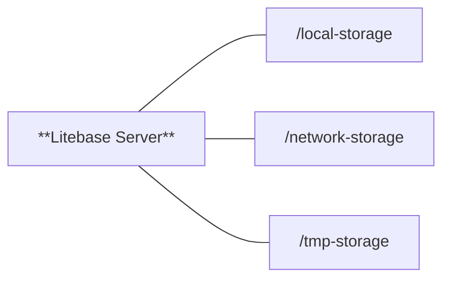
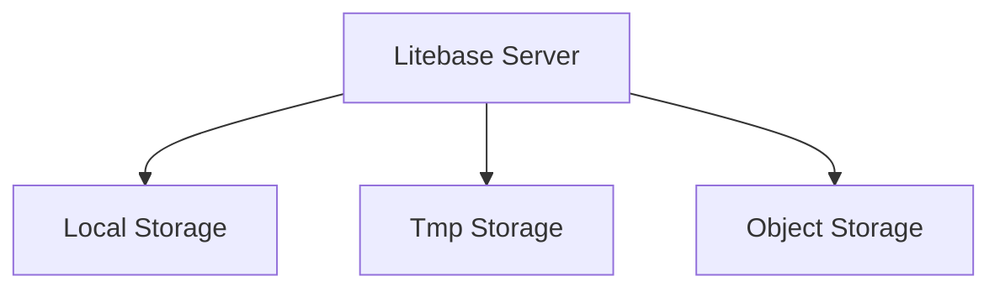
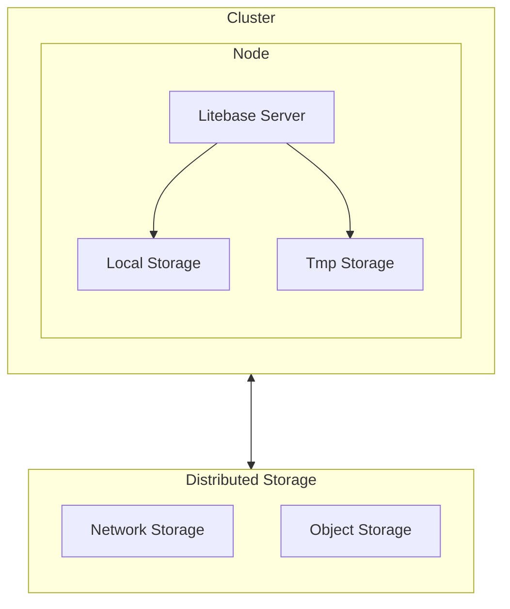

<Aside type="warning">
  Litebase is in early alpha. Many features are on the way, and these docs will
  be updated soon. Follow the progress by starring on
  [GitHub](https://github.com/litebase/litebase) and signing up for
  [updates](/).
</Aside>

<Lead>
  Litebase can be configured to run locally or on a remote server, either as a
  single node or as a cluster. Follow the steps below to configure Litebase for
  your specific needs.
</Lead>

After installing Litebase, you can configure it to match your performance, fault-tolerance, and scalability needs. Litebase runs SQLite databases whose data is ultimately stored in object storage (e.g., S3). To reduce latency and improve throughput, many database operations use a local disk-based cache.

For deployments prioritizing simplicity or minimal latency, run a single node using local storage with object storage for durablility. For high availability and fault tolerance, run a cluster that shares a distributed filesystem and uses object storage for durability.

## Getting started

After [installing](/docs/getting-started/installation) Litebase CLI, your can initialize a new configuration for Litebase Server using the following command:

```sh
litebase config init
```

This command will create a new configuration file named `~/litebase/config.yaml` in your home directory. You can then edit this file to customize the configuration for your specific needs.

If you want to create a coniguration file in the current directory instead of the home directory, you can use the `--path` flag:

```sh
litebase config init --path ./.litebase/config.yaml
```

To view the current configuration, you can use the following command:

```sh
litebase config show
```

And to view a configuration in a specific location, use the `--config` flag:

```sh
litebase config show --config ./.litebase/config.yaml
```

## Configuration reference

### Server configuration

| Field        | Type    | Required | Default        | Description                                                                        |
| ------------ | ------- | -------- | -------------- | ---------------------------------------------------------------------------------- |
| `cluster_id` | string  | Yes      | -              | Unique identifier for the Litebase cluster                                         |
| `port`       | string  | Yes      | `"9876"`       | Port number for the server to listen on                                            |
| `debug`      | boolean | No       | `false`        | Enable debug mode for verbose logging                                              |
| `key`        | string  | Yes\*    | Auto-generated | 64-character encryption key for data encryption (\*auto-generated if not provided) |

### Storage Paths

Litebase uses three filesystem paths (usually mounted directories) plus object storage:

- `storage_local_path`: local disk on each node used for caching files that do not need to be shared.
- `storage_network_path`: a shared/distributed filesystem path (NFS, GlusterFS, CephFS, etc.) mounted on every node; used for files that must be visible cluster-wide.
- `storage_tmp_path`: a local temporary directory for transient and intermediate files.

Object storage (e.g., S3) is the durable backend for database files, backups, and logs; the three paths above are used for caching and temporary work.



Litebase requires at least `storage_local_path` to be configured. If running in cluster mode, `storage_network_path` must also be configured, `storage_tmp_path` is optional but can be set to an exmplicit path for temporary files.

When using the `storage_network_path` in cluster mode, it is recommended to use a distributed filesystem such as NFS to ensure data consistency and availability across all nodes in the cluster. The distributed filesystem should be mounted on all server nodes at the same path specified in the `storage_network_path` configuration.

| Field                  | Type   | Required      | Default | Description                                                                         |
| ---------------------- | ------ | ------------- | ------- | ----------------------------------------------------------------------------------- |
| `storage_local_path`   | string | Yes           | -       | Path to local disk storage for caching                                              |
| `storage_network_path` | string | Conditional\* | -       | Path to shared network storage (\*required for cluster mode, empty for single-node) |
| `storage_tmp_path`     | string | No            | `/tmp`  | Path to temporary storage directory                                                 |

### Object storage configuration

Litebase stores all database files, logs, and backups in object storage such as S3. The following configuration options are required to connect Litebase Server to your object storage provider.

| Field                       | Type   | Required      | Default    | Description                                                                                     |
| --------------------------- | ------ | ------------- | ---------- | ----------------------------------------------------------------------------------------------- |
| `storage_object_mode`       | string | No            | `"object"` | Storage mode: `"local"` (testing) or `"object"` (S3-compatible)                                 |
| `storage_bucket`            | string | Conditional\* | -          | S3 bucket name (\*required when `storage_object_mode` is `"object"`)                            |
| `storage_endpoint`          | string | Conditional\* | -          | S3 endpoint URL, e.g., `s3.amazonaws.com` (\*required when `storage_object_mode` is `"object"`) |
| `storage_region`            | string | Conditional\* | -          | S3 region, e.g., `us-east-1` (\*required when `storage_object_mode` is `"object"`)              |
| `storage_access_key_id`     | string | Conditional\* | -          | S3 access key ID (\*required when `storage_object_mode` is `"object"`)                          |
| `storage_secret_access_key` | string | Conditional\* | -          | S3 secret access key (\*required when `storage_object_mode` is `"object"`)                      |

### TLS/SSL configuration

Litebase Server supports TLS/SSL for secure communication between clients and the server. To enable TLS/SSL, you need to provide the paths to your TLS certificate and private key files.

| Field           | Type   | Required | Default | Description                            |
| --------------- | ------ | -------- | ------- | -------------------------------------- |
| `tls_cert_path` | string | No       | -       | Path to TLS certificate file for HTTPS |
| `tls_key_path`  | string | No       | -       | Path to TLS private key file for HTTPS |

## Single node configuration

Single-node configurations are ideal for development, testing, or small-scale production environments where you want to minimize complexity and cost. They are also suitable for high-performance workloads that require low latency and high throughput. The benefit of using Litebase in this scenario is that you gain the advantages of distributed storage and caching without the overhead of managing a cluster.



### Example configuration

When configuring Litebase for a single node, set the `storage_local_path` and leave the `storage_network_path` field empty. Data will be retrieved from object storage and cached in the local filesystem.

```yaml
server:
  # Object Storage Configuration
  storage_object_mode: "object" # Use "local" for testing, "object" for production
  storage_bucket: "your-bucket-name"
  storage_endpoint: "s3.amazonaws.com"
  storage_region: "us-east-1"
  storage_access_key_id: "your-access-key-id"
  storage_secret_access_key: "your-secret-access-key"

  # Storage Paths
  storage_local_path: "/var/lib/litebase/local"
  storage_network_path: "" # Empty for single-node
  storage_tmp_path: "/var/lib/litebase/tmp"
```

## Cluster configuration

A cluster configuration is ideal for production environments that require high availability, fault tolerance, and scalability. Running a cluster of nodes helps ensure the database remains available even if individual nodes fail. You can also scale read capacity horizontally by adding nodes to handle increased load.



### Example configuration

When configuring Litebase for a cluster, set both the `storage_network_path` (the shared/distributed filesystem) and the `storage_local_path` (the node-local cache). Files from object storage that must be shared across nodes are cached on the distributed filesystem at `storage_network_path`, while files that do not need to be shared are cached locally at `storage_local_path`.

```yaml
server:
  cluster_id: "production-cluster"
  port: "9876"

  # Object Storage Configuration
  storage_object_mode: "object"
  storage_bucket: "your-bucket-name"
  storage_endpoint: "s3.amazonaws.com"
  storage_region: "us-east-1"
  storage_access_key_id: "your-access-key-id"
  storage_secret_access_key: "your-secret-access-key"

  # Storage Paths
  storage_local_path: "/var/lib/litebase/local"
  storage_network_path: "/mnt/data/litebase" # Shared across cluster
  storage_tmp_path: "/var/lib/litebase/tmp"
```

## Configuration lookup

When running Litebase Server, it looks for configuration values from multiple sources in this order:

1. `./.litebase/config.yml` in the current directory
2. `~/.litebase/config.yml` in the user's home directory (fallback)
3. Environment variables or defaults if neither file exists
4. CLI flags, which override all other sources

Below are the different formats that can be used to configure Litebase Server.

### Configuration file

```yaml
server:
  cluster_id: "your-cluster-id"
  port: "9876"
  debug: false
  key: "64-character-hex-encryption-key"
  storage_path: "/path/to/storage"
  storage_network_path: "/path/to/network/storage"
  storage_tmp_path: "/path/to/tmp/storage"
  tls_cert_path: "/path/to/cert.pem"
  tls_key_path: "/path/to/key.pem"
```

### Environment variables

These environment variables can be set in a `.env` file or directly in your shell environment.

```dotenv
LITEBASE_CLUSTER_ID=cluster_id
LITEBASE_PORT=port
LITEBASE_ENCRYPTION_KEY=key
LITEBASE_DEBUG=debug
LITEBASE_DATA_PATH=storage_path
LITEBASE_STORAGE_NETWORK_PATH=storage_network_path
LITEBASE_STORAGE_TMP_PATH=storage_tmp_path
LITEBASE_TLS_CERT_PATH=tls_cert_path
LITEBASE_TLS_KEY_PATH=tls_key_path
```

### CLI flags

These flags can be used to override the configuration file or environment variables. Please note that CLI flags are not saved to a configuration file and will only be used for the current command.

<Aside type="warning">
  **Important:** Certain configuration values like `--encryption-key`,
  `--cluster-id`, and storage paths must remain consistent across server
  restarts to avoid data corruption or misconfiguration. It's strongly
  recommended to use a configuration file for these critical settings rather
  than relying on CLI flags, which could be accidentally changed or omitted
  between runs.
</Aside>

If you choose to use CLI flags, you must specify them each time you run the command with the exact same values to maintain consistency.

```sh
litebase server start \
	--cluster-id your-cluster-id \
	--port 9876 \
	--encryption-key 64-character-hex-encryption-key \
	--storage-path /path/to/storage \
	--storage-network-path /path/to/network/storage \
	--storage-tmp-path /path/to/tmp/storage \
	--tls-cert-path /path/to/cert.pem \
	--tls-key-path /path/to/key.pem
```
